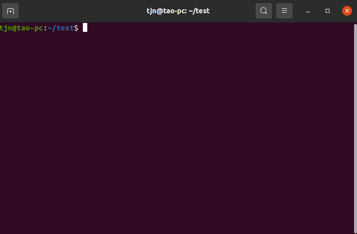

# unc-cli

A CLI that download gitlab group template to create project.

[![Version][version-badge]][package]   [![MIT License][license-badge]][license]   [![Download][download-badge]][package]

English | [简体中文](./README.zh-CN.md)

## Installation

```bash
npm i unc-cli -g
```

## Usage

### Before using, you must complete the following steps

+ set your gitlab host

  ```bash
  unc config --set gitlab.url <gitlab host>
  # example
  unc config --set gitlab.url https://gitlab.xxxx.com
  ```
  
+ set [gitlab groupId](https://docs.gitlab.com/ee/user/group/) (select and download template from this gitlab group
  
  ```bash
  unc config --set gitlab.groupId <groupId>
  ```
  
+ set gitlab access token ([how to create gitlab access token](https://docs.gitlab.com/ee/user/profile/personal_access_tokens.html#create-a-personal-access-token))

  ```
  unc config --set gitlab.token <your token>
  ```

### Now you can run this command to create project👇
```bash
unc create <project-name>
```

## Run Locally

- step1, clone the project

```bash
git clone https://github.com/taojunnan/unc-cli.git
```

- step2, install dependencies

```bash
cd unc-cli
npm install
```

- step3, [option]change command name  

	open `package.json`, replace `commandName` and `bin.unc`to your command name  

- step4, [link package](https://docs.npmjs.com/cli/v6/commands/npm-link)

```bash
npm link
```

- step5, run

```bash
unc -V
# or
<your command name> -V
```

## Example


## License

[MIT](./LICENSE)


<!-- badges -->
[version-badge]: https://img.shields.io/npm/v/unc-cli?style=flat-square
[package]: https://www.npmjs.com/package/unc-cli
[license-badge]: https://img.shields.io/npm/l/unc-cli?style=flat-square
[license]: https://opensource.org/licenses/MIT
[download-badge]: https://img.shields.io/npm/dm/unc-cli?style=flat-square