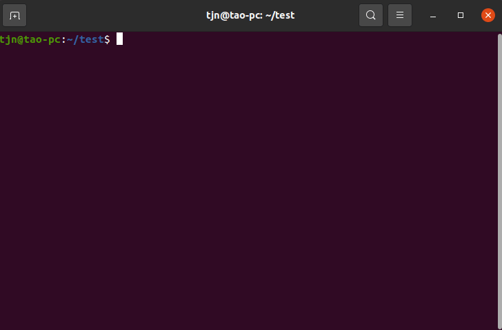

# unc-cli

通过命令行下载gitlab某个组下的模板来创建项目。

[![Version][version-badge]][package]   [![MIT License][license-badge]][license]   [![Download][download-badge]][package]

[English](./README.md) | 简体中文

## 安装

```bash
npm i unc-cli -g
```

## 使用

### 在使用前，你必须完成以下设置

+ 配置你的gitlab地址

  ```bash
  unc config --set gitlab.url <gitlab host>
  # 例如
  unc config --set gitlab.url https://gitlab.xxxx.com
  ```
  
+ 配置[gitlab groupId](https://docs.gitlab.com/ee/user/group/) (将通过这个组选择和下载模板)
  
  ```bash
  unc config --set gitlab.groupId <groupId>
  ```
  
+ 配置gitlab access token ([如何创建gitlab access token](https://docs.gitlab.com/ee/user/profile/personal_access_tokens.html#create-a-personal-access-token))

  ```
  unc config --set gitlab.token <your token>
  ```

### 现在你可以用下面的命令来创建项目了👇
```bash
unc create <project-name>
```

## 本地运行

- 第一步，克隆代码

```bash
git clone https://github.com/taojunnan/unc-cli.git
```

- 第二部，安装依赖

```bash
cd unc-cli
npm install
```

- 第三步，[可选]修改命令名称  

	打开 `package.json`, 替换 `commandName` 和 `bin.unc` 为你的命令名称  

- 第四步，[链接模块 ](https://docs.npmjs.com/cli/v6/commands/npm-link)

```bash
npm link
```

- 第五步，开始运行

```bash
unc -V
# 或
<your command name> -V
```

## 例子


## License

[MIT](./LICENSE)


<!-- badges -->
[version-badge]: https://img.shields.io/npm/v/unc-cli?style=flat-square
[package]: https://www.npmjs.com/package/unc-cli
[license-badge]: https://img.shields.io/npm/l/unc-cli?style=flat-square
[license]: https://opensource.org/licenses/MIT
[download-badge]: https://img.shields.io/npm/dm/unc-cli?style=flat-square